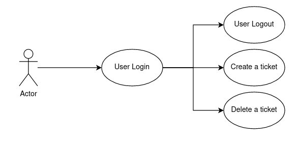
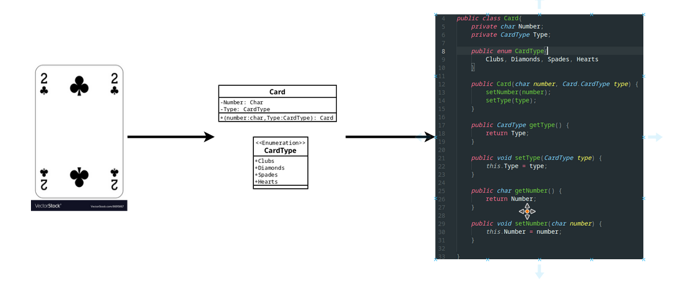
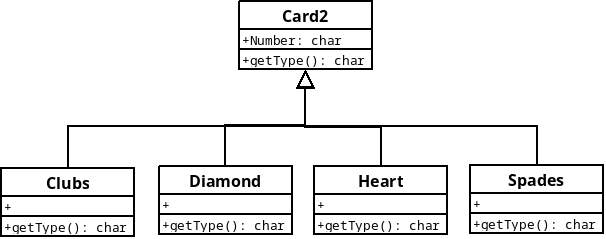

# Prop Course

## Table of contents

In this course you will see and learn the following contents. In this readme file you can find all the documentation you will need.

* PROP : Quick introduction about the subject
* Review of UML and O.O. concepts.
  * Use case description
  * Object orientation concepts
  * UML Diagrams
  * Design Patterns
  * 3-layer design
* Introduction and basics for GIT
* JAVA lang introduction
  * Basics that you will need to know			
  * Introduction to three-layer architecture
  * Manage of files inside IntelliJ
  * Controller implementation and interaction between different layers   
* SWING				

## PROP

Project subject, with 3 deliverables:

1. First deliverable: All the application domain, with test and the basic algorithm.
2. Second deliverable: Documentation of the whole project (UML diagrams).
3. Last deliverable (Project presentation) : All the group will meet with the teacher and make a demo of the project.

* The project is develop in groups of 3-4 students.
* Is mandatory to use the gitlab repository (based on git control version).
* Java version 11.*

## UML and Object Orientation concepts

### Use case diagrams

Brief description of the services offered by the system. A brief description of each use case is usually attached to the diagram.



In the example, we can see that all the use cases requires a login to create the tickets. 

Is very useful to group the use cases, in the example we can group the create/delete ticket under a use case named, for example, *Ticket Management*.

### Orientation Object concepts

The object orientation is a very useful programming concept, used to keep organized in structures all the source code and to track the bugs.

A <u>**class**</u> is an abstract representation of some object we want to model. A class is conformed of attributes and methods.

For example we can create a class to represent the Poker playing cards:



Here, we have defined an UML class that can be used to represent a card inside our system. This diagram can be implemented in all the O.O. programming languages, in the example we have used Java.

> The getters and setter methods are a very good practice to access the attributes, always declare the attributes private and generate a getter/setter method.
>
> Always is important to keep the attributes private to being able in a future to change the internal representation. Imagine the *Number* char becomes an Integer, we will need to adapt only the getter and setter method, no the others classes and methods that uses this methods. If we don't use this type of methods, we will need to change a lot of source code to adapt this representation change.

You can see in the example above, the *this* keyword. This keyword is use to reefer to the "actual" instance of the object.

#### Method overloading

This concept is used to use a same method name with different parameters. 

Imagine that we want to set the Number of a card with integers, characters and strings; for a better code develop experience (and also make the source code more readable) we can use the same method name.

```java
public class Card{
    private char Number;
    private CardType Type;
    
    public enum CardType{
        Clubs, Diamonds, Spades, Hearts
    }
    //Character with the internal representation (A-2-3...-9-J-Q-k)
    public void setNumber(char number) {
        this.Number = number;
    }
    //Character with 1(As)-2-3-4-5-...-9-10(J)-11(Q)-12(K)
    public void setNumber(Integer number){
        
    }
    //String with A,J,Q,K & numbers in [2, 9]
    public void setNumber(String number, Boolean another){
        
    }
}
```

#### Class inheritance and method override

The class inheritance is a option to <u>**redefine the behavior**</u> of a class and/or make a class more specific. For example, we can define a general card class and create four subclasses for each card type:



````java
public class Card2{
    private char Number;
    
    public Card2(char Number) {
        this.Number = Number;
    }
    
    //getter, setters, etc...
    public char getType(){return '0';}
    
    @Override
    public String toString() {
        return String.valueOf(Number) + this.getType();
    }
}

class Diamonds extends Card2{

    public Diamonds(char num){super(num);}

    @Override
    public char getType(){
        return 'D';
    }
}
public static void main(String[] args) {
    Card2 c1 = new Diamonds('9');
    Card2 c2 = new Hearts('9');
    System.out.println(c1.toString());
    System.out.println(c2.toString());
}
````

#### Abstract classes and interfaces

Following with the inheritance example, we need to ensure to don't define the card2 class, because the behavior is not clear (the method getType returns '0'). For doing this, we can define a class as abstract, this means that this class can't be instantiated.

Also, the methods can be marked as abstract; this will ensure that the subclasses will define the behavior of this method.

```java
public abstract class Card2{
    private char Number;
    
    public abstract char getType();
    
    @Override
    public String toString() {
        return String.valueOf(Number) + this.getType();
    }
}
```

#### Error handling

Following with the Poker cards examples, we can define now cards with all the characters available. The system needs to check this errors and ensure the representation is respected. This error handling can be designed :

* returning a boolean (true if all was correct, false otherwise)
* Returning an enumeration or a predefined integer value (RET_OK 1, RET_EOF 2, ...)

This two designs make the source code a bit tricky to understand, the best option is to use exceptions. An exception is an abnormal program flow, used when an error is found.

```java
public class Card2{
    //Constructor, getter, setters, etc...
    public void setNumber(char c) throws Exception{
        if(!(number >= '1' && number <= '9') ||
            !(number == 'A') || !(number == 'J') ||
            !(number == 'J') || !(number == 'Q') ||
            !(number == 'K'))
            throw new Exception("Incorrect card number");
        else this.Number = number;
    }
}
```

If the exception is not captured, the application crash. The user can treat the exceptions using a try-catch block:

````java
public static void main(String[] args) {
    Card c;
    while(true){
    	try{
            char user_input = io.readChar("Enter card number [A-2-3...-9-J-Q-K]");
            c = new Card('9', CardType.Clubs);
            break; //if we reach this line, no exception is thrown, go out of the loop.
        }
        catch(Exception e){io.println(e.getMessage());}
    }
    System.out.println(c.toString());
}
````


#### Special modifiers

We have two special modifiers, **static** and **final/constant**:

* A final/constant variable is a variable that can't be modified once is assigned.
* A static method, class or attribute is something that only is declared once for each class, not for each object. This is useful to save memory.

````java
public class Alfa {
    public final Integer a;
	public static Integer MAX_A = 100; //All instancies of Alfa will have the same variable "pointer"
    
    public Alfa(Integer x){this.a = x;}
    //This method won't compile: error: cannot assign a value to final variable a
    public void setA(Integer a){this.a = a;}
}
````

### UML diagrams

### Design patterns

### 3-layers design

## JAVA Language

Java is a object-oriented programming language, with the next main features:

* C-like syntax.

* Easier to develop code, compared with C/C++.
* The Java code is processed by the Java Virtual Machine. The compilation process checks the syntax but doesn't build a binary file.
* All objects and types at Java are derived from the Object class.

## Environment

Java offers a easy-to-install package with all the requirements to develop and launch Java applications, called **Java SE (Standard Edition)**. Inside this package there is the **JDK** (Java Development Kit) and the **JRE** (Java Runtime Environment). In our case, we will use the Open Development Kit, don't select the commercial version.

To install the packages, depending the OS you will use you can see the following webpage (https://www.java.com/en/download/). 

Ubuntu provides via Aptitude the openjdk packages:

```bash
sudo apt install openjdk-8-jre
sudo apt install openjdk-8-jdk
sudo apt-get install openjdk-8-doc #Optional -> documentation

java -version #check the java version
javac -version #check for the compiler version
```

Once we have the environment set up, we can run a hello world program:

```java
class HelloWorld{
    public static void main(String[] args) {
        System.out.println("Hello, World!");
    }
}
```

By convention, the name of the file is the name of the main class of the file, in this case *HelloWorld.java* .We can compile using:

````bash
#Generate the .java file:
javac helloworld.java	
#Run the "program", use the class name. The class needs to have a main method.
java helloworld
````

## Language Basics

### Basic types

Named primitive data types, the next types are allowed:

| Type name | Definition                                      | Literal example                                              |
| --------- | ----------------------------------------------- | ------------------------------------------------------------ |
| byte      | 8-bit signed two's complementary                | byte b = 100;                                                |
| short     | 16-bit signed two's complement integer          | short s = 1234;                                              |
| int       | 32-bit signed two's complement integer          | int i = 6584;                                                |
| long      | 64-bit signed two's complement integer          | long l = 1090000;                                            |
| float     | Single-precision 32-bit IEEE 754 floating point | float f1  = 123.4f;                                          |
| double    | double-precision 64-bit IEEE 754 floating point | double d1 = 123.4; <br>double d2 = 1.234e2; <br>double d3 = 123.4d; |
| boolean   | true/false                                      | bool x = true;                                               |
| char      | 2 byte UNICODE encodingf                        | char c = 'a';<br>char c_unicode = '\u0108'                   |

> The string data type (String) can be considered a primitive data type. The compiler will create a new object if you use the double quotes without using the *new* builder. 
>
> The next special chars can be useful: `\b` (backspace), `\t` (tab), `\n` (line feed), `\f` (form feed), `\r` (carriage return), `\"` (double quote), `\'` (single quote), and `\\` (backslash)

> Is possible to use hexadecimal and binary literals to assign to integer-type variables:
> * `int dec_val = 26;`
> * `int hexVal = 0x1a;`
> * `int binVal = 0b11010;`

> The numeric literals can use underscores to be more readable:
>
> * `long hexBytes = 0xFF_EC_DE_5E;`
> * `long creditCardNumber = 1234_5678_9012_3456L;`

Many of this basic types have a wrapper class,  including all the support/useful methods. For example the class Integer is a wrapper for the int data type with some parsing methods and other useful functions.

### Variables

The variables at Java are declared in a C-style: `int i_myInt = 0;` for example. The important facts to take into account are:

* Case sensitive at the naming. By convention the camel-case is wide-used in this language to split variable and class names. Variables can start with underscore or $ symbol, but is a bad practice.

* Static type for the variables, not as Python.

* A variable is only a pointer to an object, a new object is created with the `new` reserved word.

  ````java
  int x = 23;
  Integer xx = 44; //Can use new Integer, but the method is deprecated.
  point2d alfa = new point2d(x, xx);
  
  System.out.println(alfa.toString());
  //-> [23, 44]
  
  xx = 56;
  x = 11;
  System.out.println(alfa.toString());
  //-> [23, 44]
  
  point2d a = new point2d(0, 0);
  point2d b = new point2d(1, 1);
  point2d c = new point2d(0, 1);
  point2d d = new point2d(1, 0);
  
  List<point2d> poly = Arrays.asList(new point2d[]{a,b,c,d});
  System.out.println(poly);
  //->[[0,0], [1,1], [0,1], [1,0]]
  
  a.setX(22);
  System.out.println(poly);
  //->[[22,0], [1,1], [0,1], [1,0]]
  ````

There are different kind of variables:

* Parameters : A variable used in a method .
* Local variables: Variables used inside a curly bracket. Only accessible inside this scope.
* Class variables (C++ static) : Declared with the `static` modifier.
* Instance variable (non-static): Declared without the `static` modifier.

> Remember that all variables in Java are inside an Object because all in Java is an Object () even the main method.

###  Arrays

We can declare and allocate arrays with the following syntax:

```java
int[] array;	 		//Declare
array = new int[10]; 	//Allocate memory, deallocated via garbage collector.
array[7] = 4; 			//Access with C-style, first element at 0.
array[10] = 24; 		//Out of bounds: Throw an exception and kill the program.
```

### Operators, expressions and blocks

The operators are equal than C. You can see a summary of the operators [here](https://docs.oracle.com/javase/tutorial/java/nutsandbolts/opsummary.html).

Almost all the blocks have a C-syntax.

* If-then, If-then-else, switch-case, while and for statements are equal than C.
* The branching statements (break, continue) are equal than C, considered bad practice.

## Java classes and objects

### The Object class

### Class

### Java special attributes and methods

### Interfaces and abstract classes

### Inheritance

### Parametric classes


## Exceptions

### Try / Catch

The **try** statement allows you to define a block of code to be tested for errors while it is being executed.

The **catch** statement allows you to define a block of code to be executed, if an error occurs in the try block.

The try and catch keywords come in pairs:
````java
try {
  //  Block of code to try
}
catch(Exception e) {
  //  Block of code to handle errors
}
````

#### Example
````java
public class Main {
  public static void main(String[ ] args) {
    try {
      int[] myNumbers = {1, 2, 3};
      System.out.println(myNumbers[10]);
    } catch (Exception e) {
      System.out.println("Something went wrong.");
    }
  }
}
````

### Finally

The finally statement lets you execute code, after try...catch, regardless of the result:

````java
public class Main {
  public static void main(String[] args) {
    try {
      int[] myNumbers = {1, 2, 3};
      System.out.println(myNumbers[10]);
    } catch (Exception e) {
      System.out.println("Something went wrong.");
    } finally {
      System.out.println("The 'try catch' is finished.");
    }
  }
}
````

#### Output

````
Something went wrong.
The 'try catch' is finished.
````

### Implementation of exceptions

For implement our exceptions we will use The throw statement  that allows to create a custom error.
The throw statement is used together with an exception type. 
There are many exception types available in Java: ArithmeticException, 
FileNotFoundException, ArrayIndexOutOfBoundsException, SecurityException, etc...

#### Exemple

````java
public class Main {
  static void checkAge(int age) {
    if (age < 18) {
      throw new ArithmeticException("Access denied - You must be at least 18 years old.");
    }
    else {
      System.out.println("Access granted - You are old enough!");
    }
  }

  public static void main(String[] args) {
    checkAge(15); // Set age to 15 (which is below 18...)
  }
}
````

If we have some exceptions that are the same we can create a specific file for exceptions.

If you need to use or override some exceptions, you can refer to the following documentation to create your specific exceptions.
[Documentation custom-exception](https://www.javatpoint.com/custom-exception)

## Input/Output streaming and file management

JSON, XML.

## Java objects and packages

Java defines packages names (like the C++ *name spaces*) to avoid conflicts and duplicated names and to tidy-up the developing environment.

> The fundamentals of Java are inside the `java.lang` package, the I/O is inside the `java.io`. Notice that the packages have a tree design.

To define a package, is as simple as place at the first line of the source code `package <GlobalPackage.PackageName>`.  Attaching this line will require a folder directory with the same route.

The reserver word `import <GlobalPackage.PackageName>`  is use to include the desired elements.

### Predefined data structures

## Javadoc comments

To create documentation, the javadoc tools is the most used:

```bash
javadoc <packageName> -d <outputDirectory>
```

This will generate a web page.


To go further in Java, read about the next topics:

* JAVA annotations : https://docs.oracle.com/javase/tutorial/java/annotations/index.html
* 
